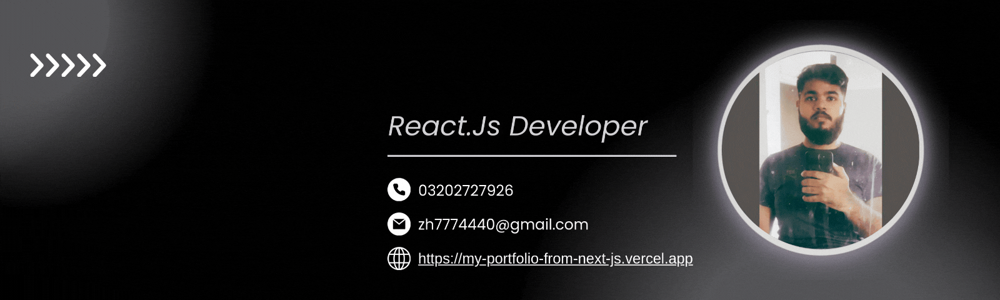

<h1 align="center">Hi 👋, I'm ZEESHAN HAIDER HERE,</h1>
<h3 align="center">I'm a passionate front-end developer that focuses on scalability while creating innovative websites.India</h3>

  

  

  

- 🌱 I’m currently learning **Backend Developer**

- 👨‍💻 All of my task are available at [https://www.linkedin.com/in/zeeshan-haider-b12338288?lipi=urn%3Ali%3Apage%3Ad_flagship3_profile_view_base_contact_details%3BCwIhVevlSMaGZHumQOrQvA%3D%3D](https://www.linkedin.com/in/zeeshan-haider-b12338288?lipi=urn%3Ali%3Apage%3Ad_flagship3_profile_view_base_contact_details%3BCwIhVevlSMaGZHumQOrQvA%3D%3D)

- 📄 My Portfolio [https://my-portfolio-from-next-js.vercel.app/](https://my-portfolio-from-next-js.vercel.app/)

- 📫 How to reach me **zh7774440@gmail.com**

<h3 align="left">Connect with me:</h3>

<h3 align="left">Languages and Tools:</h3>

  <!-- HTML -->
  
  <!-- CSS -->
  
  <!-- Bootstrap -->
  
  <!-- JavaScript -->
  
  <!-- TypeScript -->
  
  <!-- Firebase -->
  
  <!-- Git -->
  
  <!-- React.js -->
  
  <!-- Next.js -->
  
  <!-- Node.js -->
  
  <!-- Tailwind CSS -->
  
  <!-- Redux -->
  
  <!-- Figma -->
  
  <!-- React Native -->
  
  <!-- Photoshop -->
  
  <!-- Illustrator -->
  

&nbsp;

 

<h3 align="center" >Thanks For Your Support! ❤️</h3>
